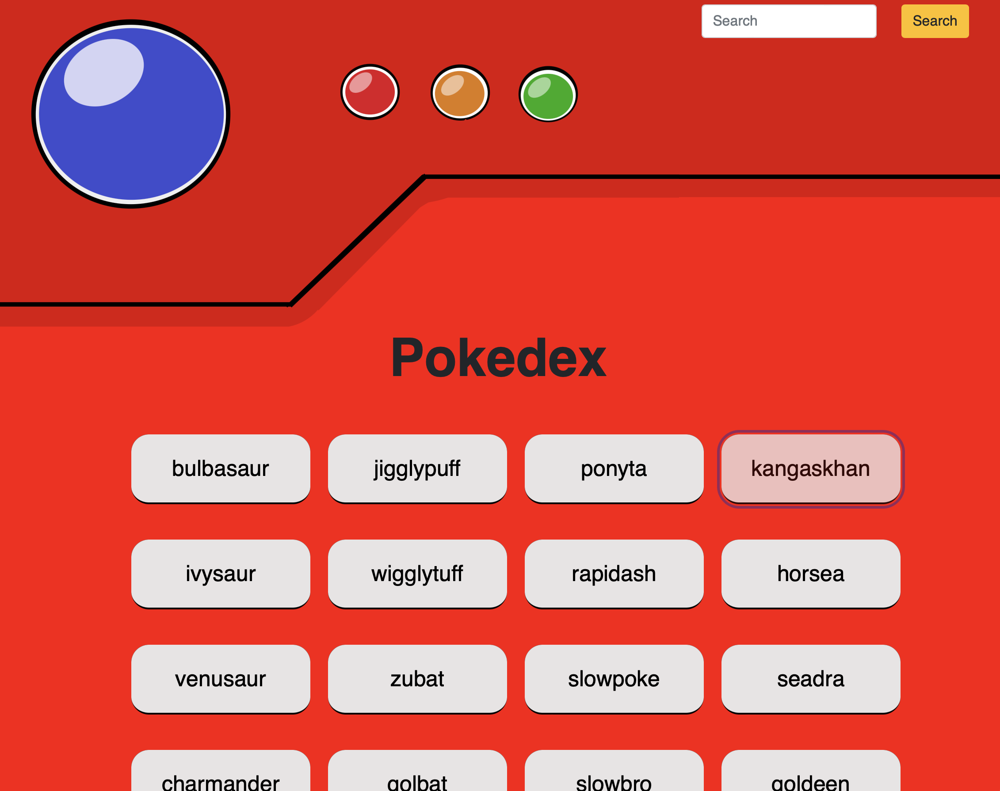

# Pokedex

This app is built with HTML, CSS, and JavaScript. It fetches data from an external API to provide a list of Pokemon, allowing users to view details such as the Pokemon's name, type, height, and image.

## Key Features
- **Load Data from an External API**: The app fetches information from an external source.
- **View a List of Items**: Users can see a list of various Pokemon.
- **View Item Details**: On user interaction, such as clicking a Pokemon, more detailed information about that Pokemon is displayed.

## Skills/Languages Used

- JavaScript
- HTML/CSS 
- jQuery
- Bootstrap
- External Api

## Example Screenshot

**Note**: The Pokedex border was crafted using Inkscape.

## Links
- [Github Repository](https://github.com/Gregpk55/simple-js-app)
- [Live Application](https://gregpk55.github.io/simple-js-app/)
